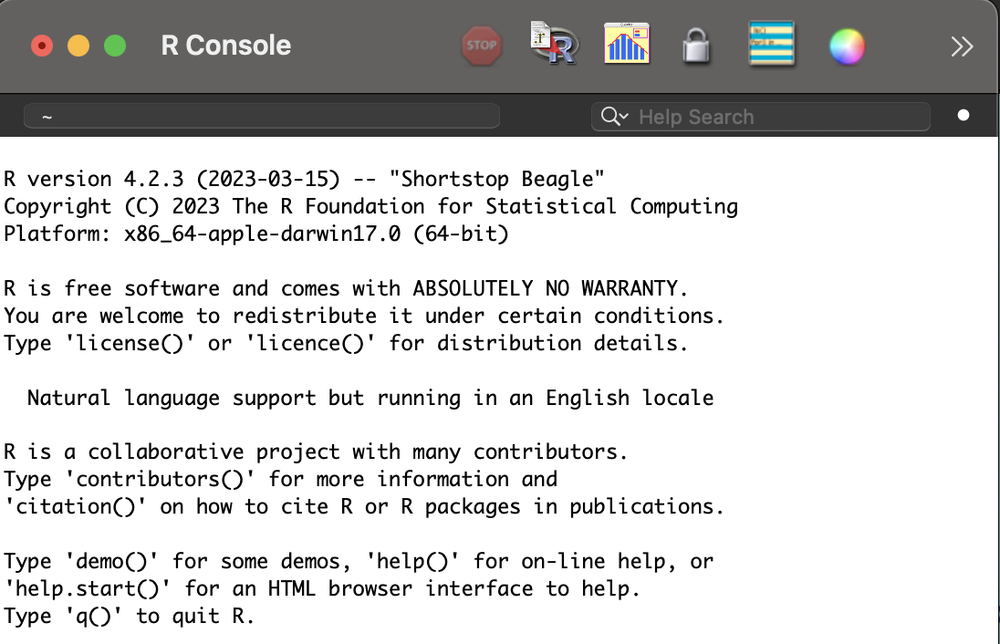
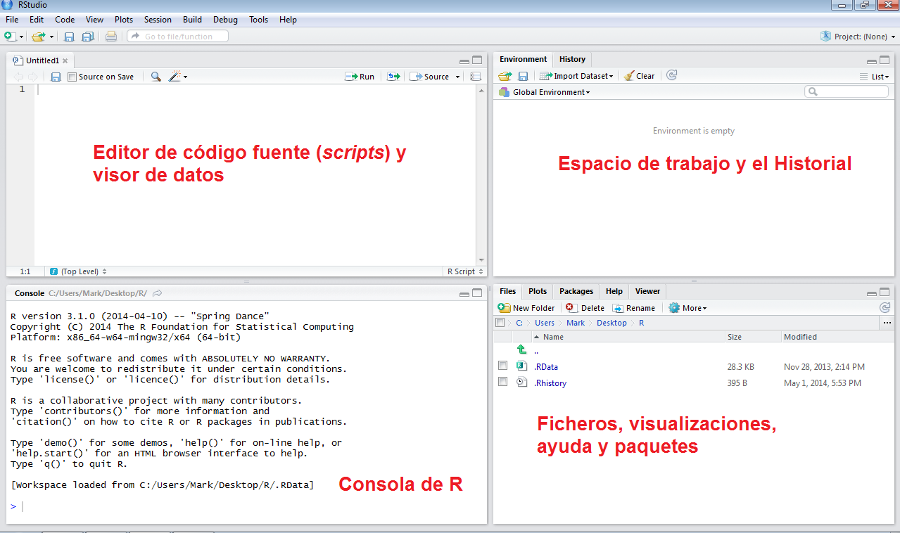
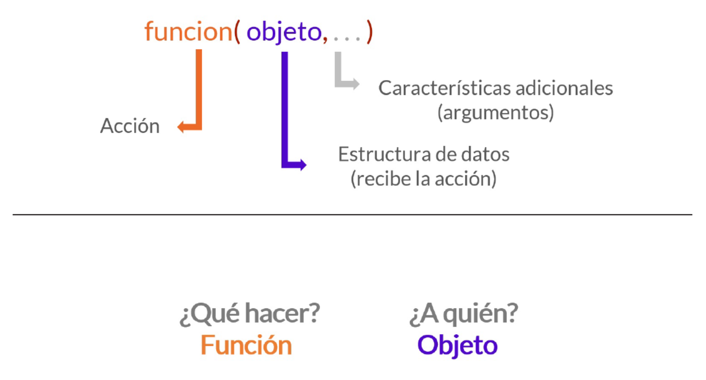
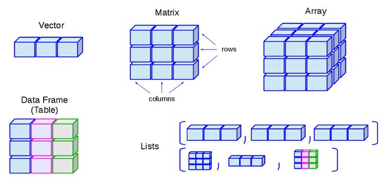

## Pasemos lista y ocupemos Menti

-   Escanea el **QR** o entra en **www.menti.com** con el código **7342 5778**

{fig-align="center" width="30%"}

## Objetivos de la clase

<br>

-   **Instalar y configurar R y RStudio** en el computador.

-   **Comprender la estructura básica de trabajo en RStudio**, incluyendo proyectos y scripts.

-   **Ejecutar comandos simples en R** y crear los primeros objetos.

-   **Cargar paquetes y explorar datos básicos** para iniciar el trabajo de análisis.

## Introducción a R y RStudio

-   R es un software libre para análisis estadístico y visualización de datos.

-   Se usa ampliamente en Sociología para explorar patrones, realizar inferencias y comunicar resultados con gráficos y tablas.

:::::: columns
:::: {.column width="50%"}
::: {style="font-size: 35px;"}
-   Ejemplos de usos en Sociología:

    -   📊 Análisis de encuestas

    -   📈 Modelos de regresión

    -   🌎 Visualización de datos
:::
::::

::: {.column width="50%"}
{fig-align="center"}
:::
::::::

## Interfaz de R

{fig-align="right"}

## Algunas diferencias entre R y RStudio

<br>

| Característica                           | R   | RStudio |
|------------------------------------------|-----|---------|
| Lenguaje de programación                 | ✅  | ✅      |
| Entorno gráfico                          | ❌  | ✅      |
| Consola interactiva                      | ✅  | ✅      |
| Gestión de proyectos                     | ❌  | ✅      |
| Soporte para gráficos, Markdown y Quarto | ❌  | ✅      |

## [Ejemplos de análisis en R: Gráfico de dispersión]{style="font-size: 0.6em;"}

```{r echo=FALSE, include=FALSE}
#packages
library(tidyverse)

#data
load("data/data_missing_complete.RData")

#Filter
table(completedData$.imp)
data <- completedData %>% 
  filter(.imp==1)
rm(completedData)

data <- data %>% 
  select(folio,
         .imp,
         .id,
         calculation,
         fluency,
         problems,
         educ2012_rec,
         edad_mesesr_2017,
         sex,
         indig_nino,
         hf_tercil,
         tadi_ST,
         wais_numST,
         wais_voST,
         home,
         type_school,
         ive_sinae_basica_2017,
         prom_mate4b_rbd_2017,
         rbd,
         n_rbd)
```

```{r echo=FALSE}
ggplot(data, aes(x = edad_mesesr_2017, y = calculation)) +
  geom_point(alpha = 0.6) +  # Hace los puntos semitransparentes
  geom_smooth(method = "lm", se = FALSE, color = "red") + 
  labs(
    title = "Relación entre cálculo escrito y edad",
    x = "Edad en meses",
    y = "Puntaje en cálculo escrito",
    caption = "Fuente: Encuesta Longitudinal de Primera Infancia ola 3 - 2017. Para más información ver: Ayala, M. C., Strasser, K., Susperreguy, M. I., & Castillo, K. \n(2024). Socioeconomic gaps in specific mathematical skills at different ages in primary school. Journal of Educational Psychology, 116(5), 762–784."
  ) +
  theme_minimal() +
  theme(
    plot.title = element_text(size = 14, face = "bold"),
    plot.caption = element_text(size = 10, hjust = 0)
  )
```

## [Ejemplos de análisis en R: Gráfico de dispersión segmentado]{style="font-size: 0.6em;"}

```{r echo=FALSE}
ggplot(data, aes(x = edad_mesesr_2017, y = calculation)) +
  geom_point(alpha = 0.6) +  
  geom_smooth(method = "lm", se = FALSE, color = "red") + 
  facet_wrap(~sex) +  # Divide el gráfico en paneles
  labs(
    title = "Relación entre cálculo escrito y edad",
    subtitle = "Segmentado por sexo",
    x = "Edad en meses",
    y = "Puntaje en cálculo escrito",
    caption = "Fuente: Encuesta Longitudinal de Primera Infancia ola 3 - 2017. Para más información ver: Ayala, M. C., Strasser, K., Susperreguy, M. I., & Castillo, K. \n(2024). Socioeconomic gaps in specific mathematical skills at different ages in primary school. Journal of Educational Psychology, 116(5), 762–784."
  ) +
  theme_minimal() +
  theme(
    plot.title = element_text(size = 14, face = "bold"),
    plot.subtitle = element_text(size = 12, face = "italic"),
    plot.caption = element_text(size = 10, hjust = 0)
  )
```

## [Ejemplos de análisis en R: Histograma]{style="font-size: 0.6em;"}

```{r echo=FALSE, include=FALSE}
rm(data)
#data
load("data/Casen_2022_ytrabajocorh.Rdata")
names(data)
summary(data$ytrabajocorh)

```

```{r echo=FALSE}
ggplot(data, aes(x = ytrabajocorh)) +
  geom_histogram(fill = "skyblue", color = "black", bins = 100) +
  scale_x_continuous(labels = scales::comma) +  # Evita notación científica
  labs(
    title = "Distribución de la variable Ingresos del trabajo hogar",
    x = "Ingresos del trabajo hogar",
    y = "Frecuencia",
    caption = "Fuente: Encuesta CASEN 2022."
  ) +
  theme_minimal()
```

<!--# Instalación y configuración - elementos básicos -->

## Instalación de R y RStudio

::: {style="font-size: 30px;"}
### 🔹 Pasos para instalar R

1.  Descarga R desde [CRAN](https://cran.r-project.org/)
2.  Instala el archivo descargado según tu sistema operativo
3.  Abre R para verificar que funciona

### 🔹 Pasos para instalar RStudio

1.  Descarga RStudio desde [Posit](https://posit.co/download/rstudio-desktop/)
2.  Instala el archivo según tu sistema operativo
3.  Abre RStudio y verifica que se ejecuta sin errores

💡 **Verificación**: Abre RStudio y ejecuta en la consola:

`sessionInfo()`
:::

## Estructura de RStudio

{fig-align="center"}

## Uso de Proyectos en RStudio

<br>

En R, la forma tradicional para indicar la carpeta de trabajo es:

```{r eval=FALSE, echo=T}
setwd("ruta/de/tu/carpeta")
```

Esto **cambia manualmente el directorio de trabajo**, pero es poco práctico: hay que modificarlo cada vez que cambias de computador o carpeta.

Un **proyecto en RStudio** guarda automáticamente la ubicación de tu trabajo, evitando usar `setwd()` y facilitando la organización y colaboración.

------------------------------------------------------------------------

::: {style="font-size: 30px;"}
| Característica | Directorio Manual (`setwd()`) | Proyecto en RStudio |
|----|----|----|
| Requiere cambiar manualmente la ruta en cada sesión | ✅ Sí | ❌ No |
| Facilita compartir el trabajo sin cambiar rutas | ❌ No | ✅ Sí |
| Organiza automáticamente archivos y scripts | ❌ No | ✅ Sí |
| Compatible con Git/GitHub | ❌ No | ✅ Sí |
| Se abre con doble clic | ❌ No | ✅ Sí |
:::

## 📂 Cómo Crear un Proyecto en RStudio

1.  Ve a **File \> New Project...**
2.  Selecciona **New Directory \> New Project**
3.  Elige un nombre y ubicación para el proyecto
4.  Guarda todos tus scripts y datos dentro de la carpeta del proyecto

💡 **Para abrir el proyecto, solo haz doble clic en el archivo `.Rproj`**

## Estructura Recomendada de un Proyecto en RStudio

``` bash
/MiProyecto/
│── /data/      # Archivos de datos
│── /scripts/   # Códigos en R
│── /figures/   # Imágenes y gráficos
│── /output/    # Resultados generados
│── MiProyecto.Rproj  # Archivo del proyecto
│── README.md   # Opcional, para documentar
```

<br>

Con README podemos indicar, por ejemplo,:

🔹 Descripción del proyecto\
🔹 Descripción de cada carpeta y archivo del proyecto\
🔹 Créditos y referencias\

## Apertura del Proyecto y Uso de Rutas Relativas

<br>

📌 **Solo necesitan hacer doble clic en el archivo `MiProyecto.Rproj`, y RStudio abrirá automáticamente la sesión con el directorio correcto.**

<br>

📌 Una vez dentro del proyecto, pueden acceder a archivos de datos sin `setwd()`, usando rutas relativas:

```{r echo=TRUE}
load("data/ELSOC_Wide_2016_2023.RData")
```

## Ejercicio: Crear un Proyecto en RStudio

::: {style="font-size: 28px;"}
1️⃣ **Abrir RStudio**: Ir a **File \> New Project...**

2️⃣ **Crear un Nuevo Proyecto**: Seleccionar **New Directory \> New Project**

-   Elegir un nombre para la carpeta del proyecto (por ejemplo, `Métodos Cuantitativos II`)
-   Guardar en Documentos (NO descargas ni escritorio)

3️⃣ **Estructura del Proyecto**: Dentro del proyecto, crear las siguientes carpetas:

``` bash
/MiPrimerProyecto/
  │── /data/      # Archivos de datos
  │── /scripts/   # Códigos en R
  │── /figures/   # Imágenes y gráficos
  │── /output/    # Resultados generados
```

4️⃣ **Mover una Base de Datos al Proyecto**: Copia o mueve el archivo `ELSOC_Wide_2016_2023.RData` a la carpeta `/data/` dentro del Proyecto.

5️⃣ **Abrir el Proyecto**: Cierra RStudio y vuelve a abrirlo haciendo doble clic en el proyecto.
:::

------------------------------------------------------------------------

## ¿Qué es un Script en R?

<br>

📌 **Un script en R** es un archivo de texto (`.R`) donde se escriben y guardan comandos para ejecutar en RStudio.

<br>

**📂 Ventajas de usar scripts en lugar de la consola:**

-   Permite **guardar y reutilizar código**.

-   Facilita la **reproducibilidad del análisis**.

-   Ayuda a **organizar el flujo de trabajo**.

## 💻 Cómo Crear un Script en R

<br>

1.  Ve a **File \> New File \> R Script**
2.  Escribe tus **comandos de R en el script**
3.  Guarda el archivo con **File \> Save**
4.  Ejecuta el código con **Run** o **Ctrl + Enter**

💡 **Los scripts (.R) permiten guardar, reutilizar y organizar tu código**

## Ejercicio: Crear un Script en R

::: {style="font-size: 38px;"}
1️⃣ **Crear y Guardar un Script**:

-   En RStudio, ir a **File \> New File \> R Script**
-   Guardar el archivo en la carpeta `/scripts/` como `Taller_1.R`

2️⃣ **Escribir un título, autor y fecha en el script:**

```{r echo=TRUE, eval=FALSE}
# Taller 1 Métodos Cuantitativos II -------------------------------------------------
# Mi nombre
# Fecha
```

3️⃣ **Cargar una Base de Datos en R**

```{r echo=TRUE, eval=FALSE}
load("data/ELSOC_Wide_2016_2023.RData")
```

💡 **Si la carga es exitosa, ahora puedes explorar los datos con `head(data)` por ejemplo.**
:::

## ¿Qué es un objeto en R?

::: {style="font-size: 30px;"}
En R, **un objeto** es una estructura que almacena información y puede ser manipulada con comandos.

-   R es un programa orientado a objetos, los que son creados por **funciones**.
-   Funciones ejecutan una acción sobre nuestros datos. Algunas requieren inputs (argumentos) que van dentro del paréntesis.
:::

{fig-align="center"}

------------------------------------------------------------------------

🔹 Tipos de objetos comunes:

<br>

::: {style="font-size: 30px;"}
| Tipo | Descripción | Ejemplo |
|------------------------|------------------------|------------------------|
| **Vector** | Lista de valores del mismo tipo | `c(1, 2, 3)` |
| **Matriz** | Datos organizados en filas y columnas | `matrix(1:6, nrow=2)` |
| **Dataframe** | Tabla con variables de distintos tipos | `data.frame(nombre=c("Ana", "Juan"), edad=c(25, 30))` |
| **Lista** | Colección de diferentes tipos de datos | `list(nombre="Ana", edad=25, notas=c(7, 8, 9))` |
:::

------------------------------------------------------------------------

{fig-align="center"}

------------------------------------------------------------------------

💡 **Ejemplo de creación de un objeto en R:**

```{r echo=TRUE}
#Character
mi_nombre <- "Maria"
mi_nombre

#Numeric
mi_numero <- 10
mi_numero

#Vector
mi_vector <- c(1, 2, 3, 4, 5)
mi_vector

#Data frame
mi_dataframe <- data.frame(nombre=c("Ana", "Juan"), edad=c(25, 30))
mi_dataframe
```

------------------------------------------------------------------------

```{r echo=TRUE}
#Lista
mi_lista <- list(mi_nombre,mi_numero,mi_vector,mi_dataframe)
mi_lista
```

::: {style="font-size: 30px;"}
**💡 Ejercicio:**

1️⃣ Crea un objeto llamado mi_nombre con tu nombre.

2️⃣ Crea un vector con los números del 1 al 10.

3️⃣ Crea un dataframe con los nombres y edades de 3 personas.
:::

## Librerías en R

::: {style="font-size: 35px;"}
**📌 ¿Qué es una librería en R?**

-   Una **librería** en R es un conjunto de funciones predefinidas que extienden las capacidades de R.
-   Cuando iniciamos R se carga solo un conjunto de funciones, datos y documentación que se conoce como **R Base**.
-   En la actualidad hay más de 21.000 paquetes.

**📦 Cómo instalar y cargar una librería**
:::

```{r echo=TRUE, eval=FALSE}
# Instalar una librería (solo una vez)
install.packages("tidyverse")

# Cargar la librería en la sesión
library(tidyverse)
```

## Ejercicio: Cargar un Paquete en R

<br>

1️⃣ Instala el paquete `tidyverse` con

```{r echo=TRUE, eval=FALSE}
install.packages("tidyverse")
```

2️⃣ Carga el paquete en tu sesión de R con

```{r echo=TRUE, eval=FALSE}
library(tidyverse)
```

3️⃣ Ejecuta el código desde tu **script** con **Run** o **Ctrl + Enter**

💡 **La instalación se hace solo una vez; cargar el paquete debe hacerse en cada sesión**

## Operadores lógicos en R

::: {style="font-size: 30px;"}
-   Sirven para hacer comparaciones y construir condiciones en funciones

<br>

| Operador | Significado | Ejemplo |
|------------------------|------------------------|------------------------|
| `==` | igual a | `species == "Human"` |
| `!=` | distinto de | `gender != "male"` |
| `>` | mayor que | `mass > 80` |
| `<` | menor que | `height < 180` |
| `&` | **y** lógico (ambas) | `species == "Human" & mass > 75` |
| `|` | **o** lógico (una u otra) | `species == "Human" | species == "Droid"` |
:::

## ❓ Preguntas y aclaraciones

<br>

💬 ¿**Dudas sobre lo visto hoy?**

-   Tómense un momento para reflexionar y compartir preguntas sobre el contenido.

-   Espacio para responder inquietudes y aclarar conceptos clave.

## Resumen clase de hoy

✔️ Conocimos qué es **R** y qué es **RStudio**, y sus diferencias

✔️ Instalamos y configuramos **R y RStudio** en nuestros computadores

✔️ Aprendimos a crear y trabajar con **proyectos en RStudio** para organizar el trabajo

✔️ Creamos y ejecutamos nuestro primer **script en R**

✔️ Introducimos los conceptos de **objetos, tipos de datos y funciones básicas**

✔️ Instalamos y cargamos nuestro primer **paquete (`tidyverse`)**

## 📆 Próxima sesión (miércoles)

<br>

-   Manipulación de datos con `tidyverse`
-   Ejercicio individual en R (con nota)

## 📚 Sugerencias lecturas para reforzar R

<br>

-   Wickham & Grolemund. R for Data Science (acceso en línea biblioteca, en español: <https://es.r4ds.hadley.nz/>)

-   [AnalizaR Datos Políticos](https://arcruz0.github.io/libroadp/index.html)

-   [YaRrr! The Pirate’s Guide to R](https://bookdown.org/ndphillips/YaRrr/)
