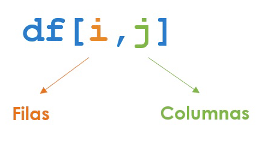
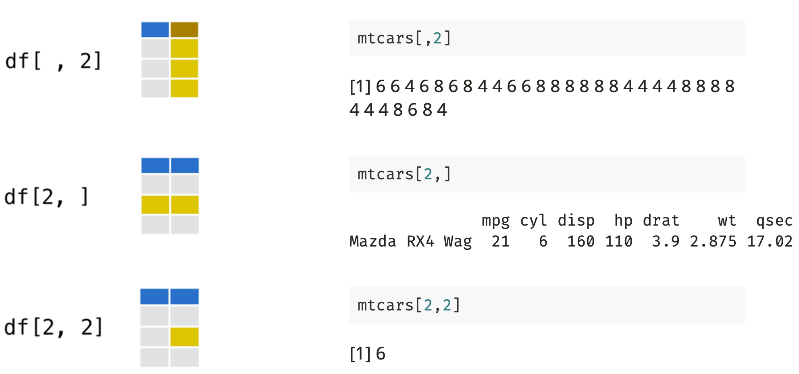
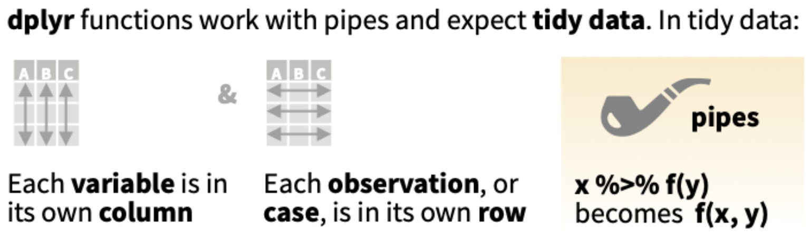
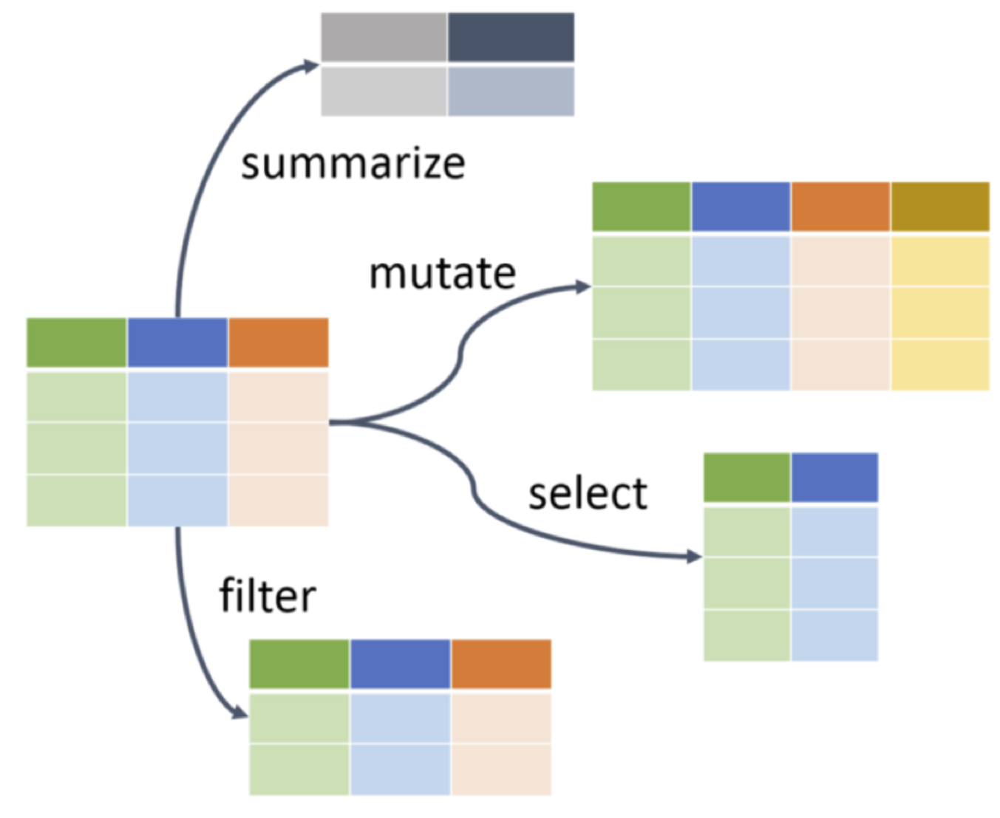
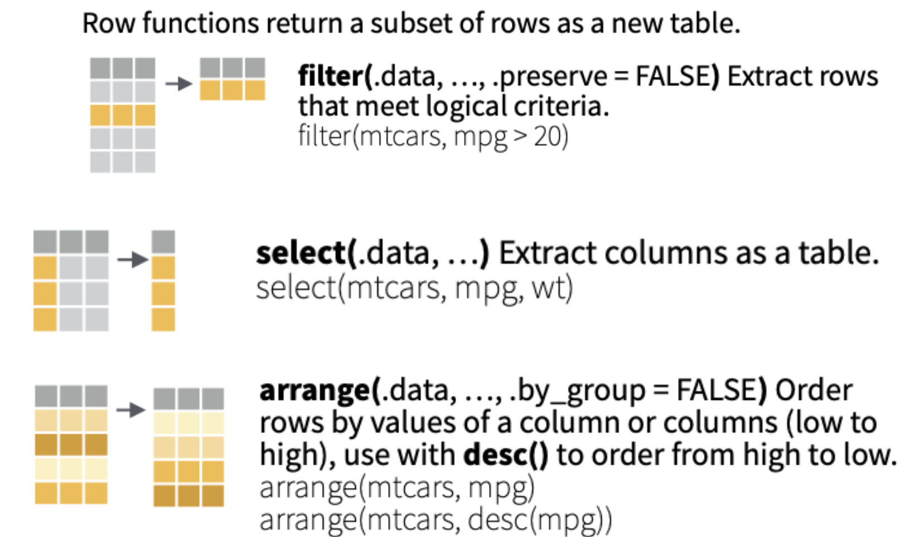

## Pasemos lista mientras descargan los materiales y dejamos todo listo ✨

::: {style="font-size: 30px;"}
📂 **Paso 1:** Abrimos nuestro proyecto con doble clic en el archivo `.Rproj`

-   Si no tienen proyecto, creamos uno: - `File > New Project > New Directory > New Project` - Creamos carpetas: `data`, `scripts`, `figures`, `output`

<br>

💾 **Paso 2:** Movemos el archivo **"Script Taller 2 Métodos Cuantitativos II.R"** a la carpeta `scripts`

<br>

📎 **Paso 3:** Movemos las bases **base_93.Rds** y **Base Evaluaciones ELPI III_reducida.RData** a la carpeta `data`\
💡 ¡Recuerda mantener el nombre original del archivo para facilitar su lectura en R!

> **Todos los materiales los pueden descargar en este link: [Materiales clases](https://github.com/mconstanzaa/met-cuanti-ii-uv-2026)**
:::

## Evaluación 1

::: {style="font-size: 30px;"}
Hoy tenemos nuestra **primera evaluación individual** en R. Debes entregar lo siguiente:

-   Proyecto de R (.Rproj).
-   El script (.R) que contiene todos los ejercicios individuales solicitados en este taller. Debes crear un script nuevo, no utilices el script de actividades entregado en la clase.
    -   En ese script, incluye un título, tu nombre, correo y fecha. Por ejemplo:

```{r echo=TRUE}
# Script Taller 2 Métodos Cuantitativos II --------------------------------------------
# M. Constanza Ayala (maria.ayala@uv.cl)
# 25-03-2026
```

**Plazo de entrega:** hoy hasta las 23:59 hrs. en el Aula Virtual.

> En caso de utilizar IA, debe reportarlo en un archivo Word, indicando la herramienta y los prompts usados. El uso no reportado será calificado con nota mínima.
:::

## Objetivos de la clase

<br>

-   Introducir principios del **uso de bases de datos** en R

<br>

-   Introducir el paquete **`dplyr` para manipulación de datos**

<br>

-   **Aplicar funciones** clave: `select()`, `filter()`, `arrange()`

## ¿Qué vimos la semana pasada en R?

<br>

✅ Creamos objetos y vectores simples\
✅ Exploramos la interfaz y creamos proyectos\
✅ Aprendimos sobre **scripts** y **librerías**

<br>

💡 ¡Hoy damos paso a la **manipulación de datos**!

## Trabajo con Bases de Datos

Recordemos que las **bases de datos** son objetos bidimensionales. Por lo que operan bajo la lógica:

{fig-align="center"}

```{r echo=TRUE}
head(mtcars)
```

------------------------------------------------------------------------

{fig-align="center"}

------------------------------------------------------------------------

Por otra parte, los objetos se pueden conservar encadenados a través de otro objeto con el operador **`$`**:

<br>

```{r echo=TRUE}
mtcars$cyl
```

<br>

-   Esto nos permite “llamar” una determinada variable del objeto base de datos.

## Extensión de las bases de datos

En R podemos trabajar con archivos de distintas **extensiones**, por ejemplo:

-   `.RData` o `.rds` → propios de R
-   `.csv` → valores separados por coma o punto-coma\
-   `.xlsx` → hojas de cálculo de Excel\
-   `.sav` → archivos de SPSS\
-   `.dta` → archivos de Stata\

Cada formato requiere funciones o paquetes específicos para ser importado.

## Importar datos en R

<br>

En R base, existen varias funciones para **cargar datos** desde distintos formatos:

-   `load("archivo.RData")`\
-   `readRDS("archivo.rds")`\
-   `read.csv("archivo.csv")`\
-   `read.table("archivo.txt")`

```{r echo=TRUE}
#Veamos un ejemplo con base en formato R

load("data/Base Evaluaciones ELPI III_reducida.RData")
```

## Paquetes para importar datos

::: {style="font-size: 38px;"}
Además de las funciones básicas, existen **paquetes especializados** que permiten trabajar con múltiples formatos, por ejemplo, los más usados son:

-   **haven** → importar archivos de SPSS (`.sav`), Stata (`.dta`) y SAS (`.sas7bdat`)

```{r, eval=FALSE, echo=TRUE}
library(haven)
data_spss <- read_sav("archivo.sav")
data_stata <- read_dta("archivo.dta")
```

-   **rio** → paquete que reconoce automáticamente el tipo de archivo

```{r, eval=FALSE, echo=TRUE}
library(rio)
data_xlsx <- import("archivo.xlsx")
data_spss <- import("archivo.sav")
data_stata <- import("archivo.dta")
```
:::

## Exportar bases de datos

<br>

Con la siguiente función base de R podemos exportar una base de datos en formato RData:

```{r echo=TRUE}
save(data, file="output/data_arrange3.RData")
```

<br>

Para exportar a otros formatos, en relación con sus funciones de importación:

```{r, echo=TRUE, eval=FALSE}
readRDS("archivo.rds") → saveRDS(data, file = "archivo.rds")

read.csv("archivo.csv") → write.csv(data, file = "archivo.csv")

read.table("archivo.txt") → write.table(data, file = "archivo.txt")
```

------------------------------------------------------------------------

## Podemos hacer lo mismo con paquetes `haven` y `rio`

-   **haven**

```{r, echo=TRUE, eval=FALSE}
library(haven)

write_sav(data_spss,  "archivo.sav")
write_dta(data_stata, "archivo.dta")
```

-   **rio**

```{r, echo=TRUE, eval=FALSE}
library(rio)

export(data_xlsx, "archivo.xlsx")
export(data_spss, "archivo.sav")
export(data_stata, "archivo.dta")
```

## Explorar la base de datos

```{r echo=TRUE}
# Podemos ver los componentes del objeto 
dim(data)   # Observaciones y variables
names(data) # Nombre de nuestras variables 
str(data)   # Visor de nuestras variables
```

------------------------------------------------------------------------

```{r echo=TRUE}
head(data) # Primeras 6 observaciones
tail(data) # Últimas 6 observaciones
```

------------------------------------------------------------------------

```{r echo=TRUE}
# Lógica fila, columna
data[1] # primera columna del data frame
data[1,] #primera fila
data[,1] #primera columna
```

------------------------------------------------------------------------

```{r echo=TRUE}
data[1,1] #elemento ubicado en la primera fila y primera columna
data[1:6,1:6] #filas de la 1 a la 6 y las columnas de la 1 a la 6
data[,c("sexo","nivel_edu_niño")] #todas las filas de las columnas
```

## Actividad 1 para ejercicio

::: {style="font-size: 28px;"}
1.  Cargar los paquetes `dplyr` y `haven` utilizando la función `library()` en una sección del script llamada `Paquetes`.

2.  Importar la base de datos `base_93.Rds` utilizando la función `readRDS()` en una sección del script llamada `Base de datos`.

3.  Explorar la base de datos en una sección llamada `Exploración base de datos` utilizando las funciones `dim()`, `names()`, `str()`, `head()` y `tail()`. Luego, responde en comentarios de R (`#`) las siguientes preguntas:
    -   ¿Cuántas observaciones y variables tiene la base? 
    -   ¿Hay variables que parezcan ser identificadores únicos de cada caso? ¿Cuáles?

4.  Incorporar en la exploración la lógica de filas y columnas, identificando:
    -   Valores de una variable (columna)
    -   Valores de un caso (fila)
    -   Un valor específico (fila y columna)
    -   Por ejemplo: `data[1,1]`
:::


## De cargar a transformar datos

<br>

-   Ya vimos cómo **importar** bases de datos en R.\
-   El siguiente paso es **trabajar con ellas**: explorarlas, transformarlas y limpiarlas.\
-   Para esto, usaremos un conjunto de funciones del paquete **`dplyr`**.

## ¿Qué es dplyr?

-   Parte de [**tidyverse**](https://www.tidyverse.org/) (colección de paquetes de R)

-   Pensado para **transformar y limpiar datos**

-   Permite escribir **código legible y encadenado** con `%>%`

{fig-align="center"}

## Ocupemos `%>%`

::: {style="font-size: 28px;"}
```{r echo=TRUE}
# Cargamos la librería
library(dplyr)

# Exploremos los datos con dplyr
data %>% glimpse() # Vista previa 

data %>% head()    # Primera 6 observaciones
```
:::

------------------------------------------------------------------------

```{r echo=TRUE}
data %>% colnames() # Nombres columnas/variables
```

## Manipulación de datos con dplyr

{fig-align="center"}

## Transformación usando vectores

{fig-align="center"}

## filter()

<br>

-   Devuelve filas que cumplen con al menos una condición lógica
-   Puedes usar operadores lógicos: $==$, $>$, $<$, $!=$, &, $|$

```{r echo=FALSE, include=FALSE}
table(data$sexo)
data$sexo <-  factor(data$sexo,
                     levels = c(1:2), #indicamos los niveles
                     labels = c("Hombre", "Mujer"))# les ponemos etiquetas
```

```{r echo=TRUE}
#Hombre
data_hombre <- data %>% 
  filter(sexo=="Hombre") 
dim(data_hombre)

#Mujer
data_mujer <- data %>% 
  filter(sexo=="Mujer")
dim(data_mujer)
```

------------------------------------------------------------------------

-   Puedes aplicar más de una condición:

<br>

```{r echo=TRUE}
data_mat1 <- data %>% 
  filter(wm_pb_pa >=36 & wm_pb_fd==36)
dim(data_mat1)

data_mat2 <- data %>% 
  filter(wm_pb_pa >=36 | wm_pb_fd==36)
dim(data_mat2)
```

## Operadores lógicos en R

::: {style="font-size: 30px;"}
-   Sirven para hacer comparaciones y construir condiciones en funciones

<br>

| Operador | Significado | Ejemplo |
|------------------------|------------------------|------------------------|
| `==` | igual a | `species == "Human"` |
| `!=` | distinto de | `gender != "male"` |
| `>` | mayor que | `mass > 80` |
| `<` | menor que | `height < 180` |
| `&` | **y** lógico (ambas) | `species == "Human" & mass > 75` |
| `|` | **o** lógico (una u otra) | `species == "Human" | species == "Droid"` |
:::

## select()

::: {style="font-size: 38px;"}
-   Devuelve solo la o las columnas que especifiques

```{r echo=TRUE}
data1 <- data %>% 
  select(1:3)
data1 %>% colnames()

data2 <- data %>% 
  select("folio", "wm_pb_pa")
data2 %>% colnames()

data3 <- data %>% 
  select("folio", "wm_pb_pa":"wm_pb_cc")
data3 %>% colnames()

data4 <- data %>% 
  select(1,edad_mesesr,sexo,idregion,wm_pb_pa:wm_pb_cc)
data4 %>% colnames()
```
:::

------------------------------------------------------------------------

-   También puedes usar: select(-columna) para excluir

```{r echo=TRUE}
data5 <- data %>% 
  select(-sexo)
data5 %>% colnames()
```

## arrange()

-   Ordena filas por una o más variables

```{r echo=TRUE}
data_arrange1 <- data4 %>% 
  arrange(wm_pb_pa)  # Por defecto el orden es creciente
head(data_arrange1, n=15)
```

------------------------------------------------------------------------

-   Usa desc() para ordenar de forma descendente

```{r echo=TRUE}
data_arrange2 <- data4 %>% 
  arrange(desc(wm_pb_pa)) # Decreciente
head(data_arrange2, n=15)
```

------------------------------------------------------------------------

-   También puedes ordenar por varias columnas

```{r echo=TRUE}
data_arrange3 <- data4 %>% 
  arrange(wm_pb_pa,wm_pb_fd)  # Utilizando dos variables
head(data_arrange3, n=15)
```

## Actividad 2 para ejercicio

::: {style="font-size: 28px;"}
1.  Crea una base de datos llamada `data_reducida` aplicando los siguientes filtros con `filter()` en una sección del script llamada `Filtros`:

    -   Mujeres (2023) (`sexo`, categoría `2`) y
    -   Personas entre 20 y 60 años (`edad`)
    -   Explora la nueva base de datos con `dim()`

2.  Selecciona las siguientes variables con `select()` en una sección del script llamada `Selección de variables`: `id_bu`, `id_bu_encuesta`, `region_3`, `zona_u_r`, `gse`, `edad`, `estado_civil_g`. Luego, explora la base de datos con `glimpse()`.

3.  Ordena la base de datos de forma ascendente según las variables `region_3` e `id_bu_encuesta` usando `arrange()` en una sección del script llamada `Arrange`. El objetivo es que, dentro de cada región, los casos queden ordenados según su id.

4.  Guarda la base de datos editada en formato RData en la carpeta `output` con el nombre `data_cep_93`.
:::


## ❓ Preguntas y aclaraciones

<br>

💬 **¿Dudas sobre lo visto hoy?**

-   Tómense un momento para reflexionar y compartir preguntas sobre el contenido.

-   Espacio para responder inquietudes y aclarar conceptos clave.

## Resumen clase de hoy

<br>

✅ Cargamos una base de datos y la exploramos

✅ Introdujimos `dplyr` para manipular datos

✅ Usamos funciones clave:

-   `filter()` para seleccionar filas según condiciones

-   `select()` para elegir o eliminar columnas

-   `arrange()` para ordenar los datos


## 📆 Próxima sesión (miércoles)

<br>

-   Continuaremos con manipulación de datos con `dplyr`

## 📚 Sugerencias lecturas para reforzar R

<br>

-   Wickham & Grolemund. R for Data Science (acceso en línea biblioteca, en español: <https://es.r4ds.hadley.nz/>)

-   [AnalizaR Datos Políticos](https://arcruz0.github.io/libroadp/index.html)

-   [YaRrr! The Pirate’s Guide to R](https://bookdown.org/ndphillips/YaRrr/)
