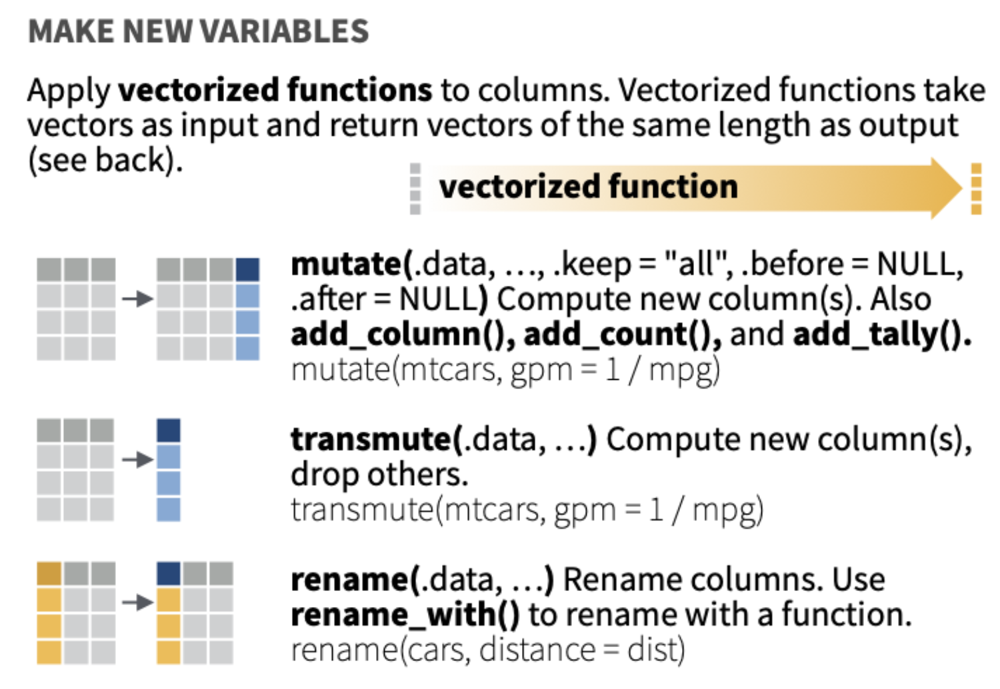

## Pasemos lista mientras descargan los materiales y dejamos todo listo ✨

::: {style="font-size: 30px;"}
📂 **Paso 1:** Abrimos nuestro proyecto con doble clic en el archivo `.Rproj`

-   Si no tienen proyecto, creamos uno: - `File > New Project > New Directory > New Project` - Creamos carpetas: `data`, `scripts`, `figures`, `output`

<br>

💾 **Paso 2:** Movemos el archivo **Script Taller 4 Métodos Cuantitativos II** a la carpeta `scripts`

<br>

📎 **Paso 3:** Movemos las bases **base_93.Rds** y **Base Evaluaciones ELPI III_reducida.RData** a la carpeta `data`\

> **Todos los materiales los pueden descargar en este link: [Materiales clases](https://github.com/mconstanzaa/met-cuanti-ii-uv-2026)**
:::

## Evaluación 2

::: {style="font-size: 30px;"}
Hoy tenemos nuestra **segunda evaluación individual** en R. Debes entregar lo siguiente:

-   Proyecto de R (.Rproj).
-   El script (.R) que contiene todos los ejercicios individuales solicitados en este taller. Debes crear un script nuevo, no utilices el script de actividades entregado en la clase.
    -   En ese script, incluye un título, tu nombre, correo y fecha. Por ejemplo:

```{r echo=TRUE}
# Script Ejercicio 2 Métodos Cuantitativos II --------------------------------------------
# M. Constanza Ayala (maria.ayala@uv.cl)
# 08-04-2026
```

**Plazo de entrega:** hoy hasta las 23:59 hrs. en el Aula Virtual.

> En caso de utilizar IA, debe reportarlo en un archivo Word, indicando la herramienta y los prompts usados. El uso no reportado será calificado con nota mínima.
:::

## Objetivos de la clase

<br>

-   Retomar el paquete **`dplyr` para manipulación de datos**

<br>

-   **Transformar y crear** nuevas variables: `mutate()`

## ¿Qué vimos la semana pasada en R?

<br>

✅ Utilizamos `filter()` para seleccionar filas según condiciones

✅ Utilizamos `select()` para elegir o eliminar columnas

✅ Utilizamos `arrange()` para ordenar filas

<br>

💡 Hoy seguimos con la **manipulación de datos** en R.

## Actividad 1 para ejercicio

<br>

1.  Carga el paquete `dplyr` en una sección del script llamada `Paquetes`.

2.  Importar la base de datos `base_93.Rds` utilizando la función `readRDS()` en una sección del script llamada `Base de datos`.

3.  Explora la base con `glimpse()` en una sección llamada `Exploración base de datos`.

## Manipulación de datos con dplyr

{fig-align="center"}

## Generar nuevas variables

{fig-align="center"}

## mutate()

<br>

-   Crea **columnas nuevas** a partir de operaciones sobre columnas existentes
-   Las nuevas columnas se agregan al final del dataframe
-   Hoy veremos tres usos:
    -   Operaciones aritméticas: sumas y promedios
    -   Recodificación de valores perdidos con `case_when()`
    -   Recodificación de valores o categorías con `case_when()`

## Carguemos el paquete y una base de datos

```{r echo=TRUE}
#Paquete
library(dplyr)

#Base de datos
load("data/Base Evaluaciones ELPI III_reducida.RData")

# Exploremos los datos con dplyr
data %>% glimpse() # Vista previa 
```

## Operaciones aritméticas

::: {style="font-size: 32px;"}
-   La base ELPI incluye tres puntajes de matemáticas: `wm_pb_pa`, `wm_pb_fd` y `wm_pb_cc`.

-   Podemos crear una variable de **suma total** y una de **promedio**:

```{r echo=TRUE}
# Suma
data <- data %>%
  mutate(suma_matematica = wm_pb_pa + wm_pb_fd + wm_pb_cc)

summary(data$suma_matematica)

# Promedio
data <- data %>%
  mutate(media_matematica = (wm_pb_pa + wm_pb_fd + wm_pb_cc) / 3)

summary(data$media_matematica)
```
:::

::: {style="font-size: 28px;"}
> Si alguna de las variables tiene `NA`, el resultado también será `NA`.
:::

## ¿Qué pasa con los valores perdidos?

::: {style="font-size: 32px;"}
Podemos usar `rowSums()` y `rowMeans()` para controlar el tratamiento de los `NA`:

```{r echo=TRUE}
# na.rm = FALSE → si hay NA, el resultado es NA (comportamiento por defecto)
data <- data %>% 
  mutate(suma_mat_naF = rowSums(cbind(wm_pb_pa, wm_pb_fd, wm_pb_cc), 
                                na.rm = FALSE))

# na.rm = TRUE → suma lo disponible aunque falten datos
data <- data %>% 
  mutate(suma_mat_naT = rowSums(cbind(wm_pb_pa, wm_pb_fd, wm_pb_cc), 
                                na.rm = TRUE))

summary(data$suma_mat_naF)
summary(data$suma_mat_naT)
```
:::

::: {style="font-size: 26px;"}
> La decisión de usar `na.rm = TRUE` o `FALSE` depende de la lógica del análisis. Ambas opciones son válidas en distintos contextos.
:::

## case_when()

-   Permite crear variables nuevas según **condiciones lógicas**
-   Funciona como una serie de reglas: *si se cumple esta condición, asigna este valor*

```{r eval=FALSE, echo=TRUE}
datos <- datos %>%
  mutate(nueva_variable = case_when(
    condición_1 ~ valor_1,
    condición_2 ~ valor_2,
    TRUE         ~ valor_si_ninguna_se_cumple
  ))
```

::: {style="font-size: 26px;"}
> La línea `TRUE ~ ...` al final actúa como "todos los demás casos". Si no la incluyes, los casos que no cumplan ninguna condición quedarán como `NA`.
:::

------------------------------------------------------------------------

## Uso 1: recodificar valores perdidos

Algunas bases de datos codifican los valores perdidos con números como `-999` o `-888`. Antes de operar con esas variables, debemos reemplazarlos por `NA`:

```{r echo=TRUE}
data <- data %>%
  mutate(sexo = case_when(
    sexo == -999 ~ NA_real_,
    sexo == -888 ~ NA_real_,
    TRUE         ~ as.numeric(sexo)
  ))

table(data$sexo, exclude = FALSE)
```

::: {style="font-size: 26px;"}
> Para variables de texto usamos `NA_character_`, para numéricas usamos `NA_real_`.
:::

## Uso 2: recodificar una variable numérica en grupos

```{r echo=TRUE}
# Clasificamos la edad del niño en valores
summary(data$edad_mesesr)

data <- data %>% 
  mutate(grupo_edad = case_when(
    edad_mesesr < 72  ~ 1,
    edad_mesesr >= 72 ~ 2,
    TRUE              ~ NA_real_
  ))

table(data$grupo_edad, exclude = FALSE)
```

## Uso 3: recodificar en múltiples categorías

::: {style="font-size: 31px;"}
También podemos usar `case_when()` para crear variables con nuevas categorías a partir de una variable existente:

```{r echo=TRUE}
table(data$idregion)

data <- data %>%
  mutate(zona = case_when(
    idregion == 13             ~ "Metropolitana",
    idregion %in% c(1:4, 15)  ~ "Norte",
    idregion %in% c(5:7)      ~ "Centro",
    idregion %in% c(8:12, 14) ~ "Sur",
    TRUE                       ~ NA_character_
  ))

table(data$zona, exclude = FALSE)
```
:::

## Actividad 2 ejercicio (base CEP 93)

::: {style="font-size: 26px;"}
1.  En una sección llamada `Mutate 1`, recodifica los valores `-8` (No sabe) y `-9` (No contesta) como `NA` en las variables `bienestar_23_a`, `bienestar_23_b`, `bienestar_23_c` y `bienestar_23_d` (preocupación por problemas en el barrio, escala 0–10) usando `mutate()` y `case_when()`. Revisa el resultado con `table(..., exclude = FALSE)` para al menos una de las variables.

2.  En una sección llamada `Mutate 2`, crea la variable `indice_preocupacion_barrio` a partir de los cuatro ítems anteriores (ya recodificados). Puedes hacerlo de dos maneras equivalentes: (1) **Opción A — índice sumatorio**. (2) **Opción B — índice promedio**. Revisa la nueva variable con `summary()`.

3.  En una sección llamada `Mutate 3`, primero recodifica los valores `-8` y `-9` como `NA` en la variable `iden_pol_2` (autoidentificación ideológica, escala 1–10). Luego crea la variable `posicion_ideologica` usando `mutate()` y `case_when()`:
    -   `"Izquierda"`: valores 1 a 4
    -   `"Centro"`: valor 5
    -   `"Derecha"`: valores 6 a 10
    -   El resto como `NA`

    Revisa la nueva variable con `table(..., exclude = FALSE)`.
:::


## Buenas prácticas al usar `mutate()`

<br>

✅ Usa nombres descriptivos: `indice_preocupacion_barrio`, `posicion_ideologica`, etc.

✅ Revisa siempre los resultados con `summary()` o `table()`

✅ Recodifica los valores perdidos **antes** de calcular sumas o promedios

✅ Controla el tratamiento de `NA` explícitamente: - En `rowMeans()` / `rowSums()`: usa `na.rm = TRUE/FALSE` - En `case_when()`: incluye `TRUE ~ NA_character_` o `TRUE ~ NA_real_` al final


## ❓ Preguntas y aclaraciones

<br>

💬 **¿Dudas sobre lo visto hoy?**

-   Tómense un momento para reflexionar y compartir preguntas sobre el contenido.

-   Espacio para responder inquietudes y aclarar conceptos clave.

## Resumen clase de hoy

<br>

✅ Aprendimos a usar `mutate()` para crear nuevas variables

✅ Calculamos sumas y promedios con y sin `NA`

✅ Recodificamos valores perdidos con `case_when()`

✅ Recodificamos categorías con `case_when()`


## 📆 Próxima sesión (miércoles)

<br>

-   Correlaciones y regresión lineal simple


## 📚 Sugerencias lecturas para reforzar R

<br>

-   Wickham & Grolemund. R for Data Science (acceso en línea biblioteca, en español: <https://es.r4ds.hadley.nz/>)

-   [AnalizaR Datos Políticos](https://arcruz0.github.io/libroadp/index.html)

-   [YaRrr! The Pirate's Guide to R](https://bookdown.org/ndphillips/YaRrr/)
