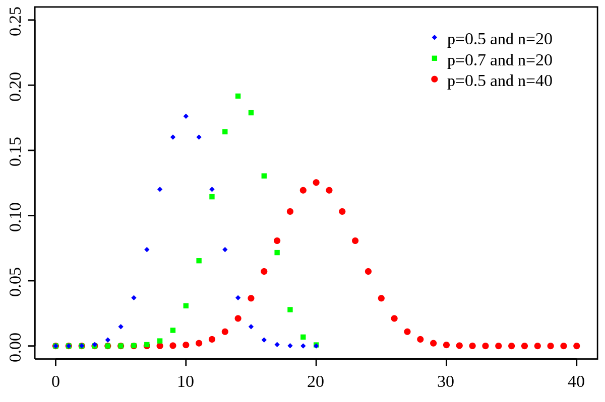

## Pasemos lista mientras descargan los materiales y dejamos todo listo ✨

::: {style="font-size: 30px;"}
📂 **Paso 1:** Abrimos nuestro proyecto con doble clic en el archivo `.Rproj`

- Si no tienen proyecto, creamos uno: `File > New Project > New Directory > New Project`
- Creamos carpetas: `data`, `scripts`, `figures`, `output`

<br>

💾 **Paso 2:** Movemos el archivo **Script Taller 8 Métodos Cuantitativos II.R** a la carpeta `scripts`

<br>

📎 **Paso 3:** Verificamos que la base **base_92_20112024.Rds** esté en la carpeta `data`

> **Todos los materiales los pueden descargar en este link: [Materiales clases](https://github.com/mconstanzaa/met-cuanti-ii-uv-2026)**
:::

## Actividades prácticas

A lo largo de la clase realizaremos **dos actividades prácticas** para ejercitar cada función vista.

No tienen nota, pero recomiendo resolverlas en un script aparte para que quede como material de estudio.

- Crea un script nuevo (no uses el script de actividades de la clase) e incluye un título, tu nombre, correo y fecha. Por ejemplo:

```{r echo=TRUE}
# Actividades Taller 8 Métodos Cuantitativos II ----------------------------
# M. Constanza Ayala (maria.ayala@uv.cl)
# 10-06-2026
```

## Objetivos de la clase

<br>

- **Estimar** modelos de regresión logística binomial con `glm()`

- **Interpretar** coeficientes en escala logit y en términos de odds ratio

- **Evaluar** la bondad de ajuste: diferencia de devianzas, AIC y pseudo-$R^2$ de Nagelkerke

## ¿Qué vimos la sesión pasada?

<br>

✅ Interpretamos coeficientes no estandarizados ($b$) y estandarizados ($\beta$) con `tab_model()`

✅ Interpretamos una variable categórica como *dummy* en el modelo

✅ Evaluamos los supuestos del modelo de regresión lineal: linealidad, independencia, homocedasticidad, normalidad de residuos y valores influyentes

<br>

💡 Hoy avanzamos hacia la **regresión logística binomial**: el modelo apropiado cuando la variable dependiente es binaria.

## Preparación del entorno

```{r echo=TRUE}
# Ajustes previos ---------------------------------------------------------
options(scipen = 999)

# Paquetes ----------------------------------------------------------------
library(tidyverse)
library(sjPlot)
library(DescTools)

# Base de datos -----------------------------------------------------------
data <- readRDS("data/base_92_20112024.Rds")

# Vista previa
data %>% glimpse()
```

## Variables que usaremos

::: {style="font-size: 30px;"}
Trabajaremos con tres variables de la **Encuesta CEP N° 92** (agosto–septiembre 2024):

| Variable | Pregunta (resumida) | Escala / Categorías |
|------------------------|------------------------|------------------------|
| `mtf_45_h` | Una pareja del mismo sexo puede criar a un niño/a tan bien como una pareja heterosexual | 1 Muy de acuerdo … 5 Muy en desacuerdo |
| `sexo` | Sexo del encuestado/a | 1 Hombre / 2 Mujer |
| `esc_nivel_1_c` | Escolaridad por nivel | Numérica (0–10) |

<br>

> Los valores **-8** (No sabe) y **-9** (No contesta) corresponden a **datos perdidos** y deben recodificarse como `NA` antes de cualquier análisis.
:::

## Preparación de variables

::: {style="font-size: 28px;"}
Recodificamos valores perdidos en la VD y en escolaridad con `across()`:

```{r echo=TRUE}
data <- data %>%
  mutate(across(c(mtf_45_h, esc_nivel_1_c), ~ case_when(
    . %in% c(-8, -9) ~ NA_real_,
    TRUE ~ .
  )))
```

Exploramos la distribución original de `mtf_45_h`:

```{r echo=TRUE}
data %>%
  group_by(mtf_45_h) %>%
  summarise(N = n(),
            Porcentaje = round(100 * n() / nrow(data), 1))
```
:::

------------------------------------------------------------------------

::: {style="font-size: 28px;"}
Binarizamos la VD: categoría 1 = "Muy de acuerdo / De acuerdo" (valores 1 y 2); categoría 0 = "Otro" (valores 3, 4 y 5):

```{r echo=TRUE}
data <- data %>%
  mutate(mtf_45_h = case_when(
    mtf_45_h %in% c(1, 2) ~ "Muy de acuerdo / De acuerdo",
    mtf_45_h %in% c(3:5)  ~ "Otro",
    TRUE                   ~ NA_character_
  ))

data %>%
  group_by(mtf_45_h) %>%
  summarise(N = n(),
            Porcentaje = round(100 * n() / nrow(data), 1))
```
:::

------------------------------------------------------------------------

```{r echo=TRUE}
# Etiquetas en sexo
data$sexo <- factor(data$sexo,
                    levels = c(1:2),
                    labels = c("Hombre", "Mujer"))

# Verificamos NA en las tres variables
data %>%
  summarise(across(c(mtf_45_h, sexo, esc_nivel_1_c),
                   ~ sum(is.na(.))))

# Eliminamos casos con NA en VD y escolaridad
data <- data %>%
  drop_na(mtf_45_h, esc_nivel_1_c)

dim(data)
```

------------------------------------------------------------------------

## Estadísticos descriptivos

```{r echo=TRUE}
# Distribución por sexo
data %>%
  group_by(Sexo = sexo) %>%
  summarise(N = n(),
            Porcentaje = round(100 * n() / nrow(data), 1))

# Distribución de la VD
data %>%
  group_by(Homoparentalidad = mtf_45_h) %>%
  summarise(N = n(),
            Porcentaje = round(100 * n() / nrow(data), 1))
```

------

```{r echo=TRUE}
# Escolaridad
summary(data$esc_nivel_1_c)
```


## Regresión logística binaria
:::::: {style="font-size: 35px;"}
El modelamiento estadístico con **datos binarios** busca **estimar la probabilidad de éxito o fracaso de un evento** como una función de un conjunto de variables independientes.

::::: columns
::: {.column width="60%"}
- La distribución de $Y$ es especificada por las probabilidades de éxito $P(Y=1)=\pi$ o fracaso $P(Y=0)=(1-\pi)$, es decir, sigue una **distribución binomial** ($X \sim Bin(n,\pi)$).
- Hoy existen dos modelos ampliamente usados: **modelos logísticos (logit)** y **modelos probit**.
:::

::: {.column width="40%"}
{fig-align="center"}
:::
:::::
::::::


------------------------------------------------------------------------

## El modelo: ecuación en log-odds

La ecuación del modelo para este ejemplo es:

$$\log\left(\frac{P(\text{Acuerdo} = 1)}{1 - P(\text{Acuerdo} = 1)}\right) = \hat{\beta}_0 + \hat{\beta}_1 \cdot \text{Mujer} + \hat{\beta}_2 \cdot \text{Escolaridad}$$

::: {style="font-size: 28px;"}
Donde:

- El lado izquierdo es el **log-odds** (logit) de que la persona esté de acuerdo con la homoparentalidad
- $\hat{\beta}_0$ es el intercepto: el log-odds esperado cuando todos los predictores valen cero
- $\hat{\beta}_1$ y $\hat{\beta}_2$ indican el cambio en el log-odds asociado a cada predictor
- El **signo** del coeficiente indica la dirección: $b > 0$ aumenta la probabilidad de $Y = 1$; $b < 0$ la reduce
:::

## Estimación con `glm()`

::: {style="font-size: 30px;"}
La función `glm()` con `family = "binomial"` estima el modelo logístico por máxima verosimilitud.
:::

```{r echo=TRUE}
# Definimos la categoría de referencia de la VD
data$mtf_45_h <- fct_relevel(as.factor(data$mtf_45_h), "Otro")

# Modelo nulo (solo intercepto)
m0 <- glm(mtf_45_h ~ 1,             data = data, family = "binomial")

# Modelo 1: sexo
m1 <- glm(mtf_45_h ~ sexo,          data = data, family = "binomial")

# Modelo 2: escolaridad
m2 <- glm(mtf_45_h ~ esc_nivel_1_c, data = data, family = "binomial")

# Modelo 3: sexo + escolaridad
m3 <- glm(mtf_45_h ~ sexo + esc_nivel_1_c, data = data, family = "binomial")
```


------------------------------------------------------------------------

## Output de `summary()`: lectura del modelo

::: {style="font-size: 26px;"}
```{r echo=TRUE}
summary(m3)
```
:::

------------------------------------------------------------------------

## ¿Qué leemos en el output de `summary()`?

::: {style="font-size: 33px;"}
El output entrega tres bloques clave:

**1. Coeficientes**: estimaciones de $\hat{\beta}$ en escala de **log-odds**, con error estándar, estadístico $z$ y p-valor. El test de Wald contrasta $H_0: \beta_k = 0$; se rechaza si $p < .05; p < .01$.

**2. Null deviance y Residual deviance**: la null deviance es el desvío del modelo sin predictores (solo intercepto); la residual deviance es el desvío del modelo con los predictores incluidos. A menor desvío residual, mejor ajuste. La diferencia entre ambos indica cuánto mejora el ajuste al incorporar los predictores.

**3. AIC**: criterio de información de Akaike. Penaliza por el número de parámetros. A menor AIC, mejor ajuste relativo. Útil para comparar modelos estimados sobre los misma muestra.
:::

------------------------------------------------------------------------


## Interpretación en escala logit

::: {style="font-size: 30px;"}
A partir del output del Modelo 3 (`mtf_45_h ~ sexo + esc_nivel_1_c`):

- **`sexoMujer`** ($\hat{\beta} = 0.78$, $p < .001$): ser mujer se asocia con un **aumento** en los log-odds de estar de acuerdo con la homoparentalidad, en comparación con los hombres, controlando por escolaridad. El coeficiente es estadísticamente significativo al 99% de confianza.

- **`esc_nivel_1_c`** ($\hat{\beta} = 0.11$, $p < .001$): cada nivel adicional de escolaridad se asocia con un **aumento** en los log-odds de acuerdo, controlando por sexo. El coeficiente es estadísticamente significativo al 99% de confianza.

> Los coeficientes en escala logit indican dirección y significancia, pero su magnitud no es directamente interpretable. Para una interpretación sustantiva se utilizan los **odds ratio**.
:::

## Odds ratio

::: {style="font-size: 30px;"}
El **odds ratio** (OR) es la exponencial del coeficiente logístico:

$$OR = e^{\hat{\beta}}$$

Su interpretación:

- $OR > 1$: el predictor **aumenta** los odds de $Y = 1$
- $OR < 1$: el predictor **reduce** los odds de $Y = 1$
- $OR = 1$: el predictor no tiene asociación con $Y$

Para una variable categórica: el OR compara los odds de la categoría indicada respecto a la categoría de referencia.

Para una variable continua: el OR indica el **factor por el que se multiplican** los odds por cada unidad adicional en $X$.
:::

------------------------------------------------------------------------

## `tab_model()` con odds ratio

```{r echo=TRUE, eval=FALSE}
tab_model(m1, m2, m3,
          show.ci  = FALSE,
          show.se  = TRUE,
          show.aic = TRUE,
          dv.labels = c("Modelo 1", "Modelo 2", "Modelo 3"))
```

---

```{r echo=FALSE}
tab_model(m1, m2, m3,
          show.ci  = FALSE,
          show.se  = TRUE,
          show.aic = TRUE,
          dv.labels = c("Modelo 1", "Modelo 2", "Modelo 3"))
```

------------------------------------------------------------------------

## Interpretación del odds ratio

A partir del Modelo 3:

- **`sexoMujer`** (OR = 2.18, $p < .001$): los odds de que una mujer esté de acuerdo con la homoparentalidad son **2.18 veces mayores** que los de un hombre, controlando por escolaridad. Con un 99% de confianza.

- **`esc_nivel_1_c`** (OR = 1.12, $p < .001$): por cada año adicional de escolaridad, los odds de acuerdo se **multiplican por 1.12**, controlando por sexo. Con un 99% de confianza.


------------------------------------------------------------------------

## Cálculo manual del OR

También es posible obtener los odds ratio directamente desde los coeficientes:

```{r echo=TRUE}
# Odds ratio del modelo 3
exp(coef(m3))

# Interpretación de sexoMujer: aumento porcentual en los odds
(exp(coef(m3)["sexoMujer"]) - 1) * 100
```

::: {style="font-size: 28px;"}
> El aumento porcentual en los odds se calcula como $(OR - 1) \times 100$. En este caso, los odds de acuerdo son aproximadamente un **118% mayores** entre las mujeres que entre los hombres.
:::

## Actividad práctica 1

::: {style="font-size: 27px;"}
En el script de actividades, en una sección llamada `Modelo logístico`:

1.  Recodifica `religion_14` de la siguiente forma en una sección llamada `Preparación VD`:

    - Excluye los valores no válidos (-8 y -9) como `NA`
    - Categoría `"Sí"`: valor 3 (el aborto debe ser una opción para las mujeres, en cualquier caso)
    - Categoría `"No"`: valores 1 y 2 (siempre prohibido / solo en casos especiales)
    - Define `"No"` como categoría de referencia con `fct_relevel()`

2.  Estima tres modelos con `glm(family = "binomial")` en una sección llamada `Modelos`:
    
    - `m0_aborto`: `religion_14 ~ 1`
    - `m1_aborto`: `religion_14 ~ sexo`
    - `m2_aborto`: `religion_14 ~ sexo + esc_nivel_1_c`

3.  Visualiza los resultados con `tab_model(show.exp = TRUE, show.ci = TRUE)`.

4.  Incluye en comentarios (`#`) la interpretación del OR de cada predictor en `m2_aborto`: dirección, magnitud y significancia estadística.
:::

## Bondad de ajuste

<br>

::: {style="font-size: 30px;"}
A diferencia de la regresión lineal, el modelo logístico no cuenta con un $R^2$ en sentido estricto. Utilizamos tres indicadores complementarios:

**1. Diferencia de devianzas** — chi-cuadrado del modelo: diferencia entre la devianza nula y la devianza residual. Contrasta si los predictores mejoran el ajuste respecto al modelo sin predictores.

**2. AIC** — permite comparar modelos estimados sobre la misma muestra. Penaliza la complejidad del modelo; se prefiere el modelo con menor AIC.

**3. Pseudo-**$R^2$ de Nagelkerke — análogo al $R^2$ de MCO; varía entre 0 y 1. Indica la proporción de varianza en $Y$ capturada por el modelo, aunque su interpretación es aproximada.
:::

------------------------------------------------------------------------

## Cálculo de los indicadores

::: {style="font-size: 33px;"}
```{r echo=TRUE}
# 1. Diferencia de devianzas (chi-cuadrado del modelo)
# H0: el modelo con predictores no mejora el ajuste respecto al modelo nulo
anova(m0, m3, test = "Chisq")

# 2. AIC
AIC(m0, m1, m2, m3)

# 3. Pseudo-R² de Nagelkerke (DescTools)
PseudoR2(m3, which = "Nagelkerke")
```
:::

------------------------------------------------------------------------

## Interpretación: bondad de ajuste

<br>

::: {style="font-size: 33px;"}
Para el Modelo 3 (`mtf_45_h ~ sexo + esc_nivel_1_c`):

- **Chi-cuadrado del modelo**: $\chi^2(2) = 65.23$, $p < .001$. Se rechaza $H_0$: el modelo con sexo y escolaridad mejora significativamente el ajuste respecto al modelo nulo. Los predictores capturan varianza en la VD más allá del azar.

- **AIC**: el Modelo 3 presenta el menor AIC entre los cuatro modelos estimados (AIC = 1886.20), lo que indica que es el modelo con mejor ajuste relativo.

- **Pseudo-**$R^2$ de Nagelkerke: 0.06. El valor indica un ajuste modesto, lo que es esperable: las actitudes son fenómenos multideterminados que un modelo con dos predictores no puede capturar en su totalidad.
:::

## Actividad práctica 2

::: {style="font-size: 35px;"}
En el script de actividades, en una sección llamada `Bondad de ajuste`:

1.  Calcula la **diferencia de devianzas** entre el modelo `m0_aborto` y `m2_aborto`. ¿Se rechaza $H_0$? ¿Qué implica eso?

2.  Compara el **AIC** de `m0_aborto`, `m1_aborto` y `m2_aborto` con `AIC()`. ¿Cuál presenta mejor ajuste?

3.  Calcula el **pseudo-**$R^2$ de Nagelkerke de `m2_aborto` con `DescTools::PseudoR2()`. ¿Qué nos indica?

4.  Incluye en comentarios (`#`) una conclusión breve integrando los tres indicadores: ¿cuál es el modelo con el mejor ajuste?
:::

## ❓ Preguntas y aclaraciones

<br>

💬 **¿Dudas sobre lo visto hoy?**

- Tómense un momento para reflexionar y compartir preguntas sobre el contenido.

- Espacio para responder inquietudes y aclarar conceptos clave.

## Resumen de la clase de hoy

<br>

✅ Estimamos modelos de regresión logística binomial con `glm(family = "binomial")`

✅ Interpretamos coeficientes en escala logit:

✅ Calculamos e interpretamos odds ratio 

✅ Evaluamos la bondad de ajuste: diferencia de devianzas, AIC y pseudo-$R^2$ de Nagelkerke

## 📆 Próxima sesión

<br>

- Ejercicio recuperativo

## 📚 Sugerencias lecturas

<br>

- Wickham & Grolemund. R for Data Science (en español: <https://es.r4ds.hadley.nz/>)

- [AnalizaR Datos Políticos](https://arcruz0.github.io/libroadp/index.html)

- [YaRrr! The Pirate's Guide to R](https://bookdown.org/ndphillips/YaRrr/)
